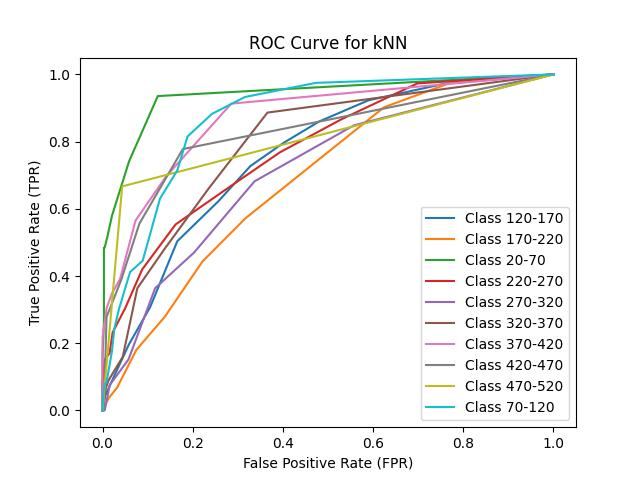

# Airbnb Price Predictor 

## Motivation 
The goal of this project is to create a model for predicting nightly prices of Airbnb listings in Vancouver. Accurate price prediction can provide valuable insights for both hosts looking to optimize their listings and guests seeking cost-effective options.

The dataset consists of web-scraped information about Airbnb listings in Vancouver, such as property type, location, amenities, host details, and review statistics. By preprocessing and analyzing this data, we aim to identify the most significant factors affecting price and develop an accurate predictive model. 

## Installation
1. Clone the repository.
2. create a 'data' folder and download the following csv into it: https://drive.google.com/file/d/1EiJwpEVXZrFapdx5A3pziArN_9ZwzXhO/view?usp=sharing
3. Install dependencies.
`pip install -r requirements.txt`
3. Run `python script.py` (or `python3 script.py` depending on your Python version) from the base directory. This will sequentially perform preprocessing, exploratory data analysis, clustering, outlier detection, feature selection, and classification. This process will generate the artifacts within the **visualizations** folder. 

    **Note:** Depending on your Python version, you may need to edit the `script.py` file to replace `python3` commands with `python`.

## Preprocessing
### Step 1: Dropping Irrelevant Attributes
The first step in this process was to eliminate any attributes that were clearly irrelevant to our goal. These included:

- **Unique identifiers**: Such as `id`, `listing_url`, and `scrape_id`, which do not contribute to predictive power.
- **Long text attributes**: For example, detailed descriptions or reviews, which were deemed too unstructured and verbose for our needs. These features could be re-introduced for future work in this realm.
- **Redundant attributes**: Features already captured in cleaner or more structured formats elsewhere, ensuring we avoided duplication and confusion in the dataset.

This step helped reduce the complexity of the data for more clarity and efficiency in further processing and modelling. 

---

### Step 2: Data Cleaning and Augmentation
We cleaned several attributes to ensure consistency and usability:

- **Price**: Converted to a float by removing the `$` symbol.  
- **Percent columns**: Cleaned by removing the `%` symbol for accurate numeric representation.  

Following this, we transformed the `amenities` column into an actual array format and added a new feature called **`amenity_count`**, which represents the **length** of the amenities array. We also label binarized the specific amenities while dropping any amenities that were used in less than 5% of the data. These amenities were pseudo-unique-identifiers which provided no predictive utility.

Listings with a price of $500 or more were dropped. 299 rows were dropped in this step. This decision was made to address the following issues:

- **Skewed Distribution**: Listings with prices $500 or higher created a highly skewed distribution in the dataset, as the majority of listings were priced significantly lower. Retaining these extreme outliers would have distorted the overall price distribution and negatively impacted subsequent analysis.

- **Impact on Binning**: We chose to bin the price feature, these high-priced listings would have caused issues regardless of whether we used equal-width or equal-depth binning:
  - **Equal-width bins**: These outliers would have increased the bin count, leading to most bins being sparsely populated and reducing their usefulness for capturing meaningful groupings.
  - **Equal-depth bins**: The outliers would have disproportionately influenced bin boundaries, forcing the inclusion of unrelated listings in the same bin to balance the number of samples per bin. This also adjusted the width of each bin making the classifications less helpful to the final prediction task.
- **Alignment with goal**: Removing high-priced rows also helped us narrow the scope of our task to only cover the majority of Airbnbs. Those who are interested in expensive Airbnb's likely aren't as concerned with price as the majority of the userbase. 

We dropped listings where the acceptance rate was under 10% as this was indicative that the listing was potentially inactive or unreliable. Finally, we dropped any listing that did not have a value in the price column. After this process of dropping rows, we were left with 4285 rows out of 6211 initially. Approximately 1300 were dropped due to missing price, 300 due to price being over 500 and 400 from the host acceptance rate being too low.  

This process in cleaning helped balance the dataset to allow for future generalization and analysis. 

### Step 3: Imputation
To handle missing values in the dataset, we applied a straightforward imputation strategy:

- **Numerical Columns**: Missing values were replaced with the **mean** of the column.
- **Categorical Columns**: Missing values were replaced with the **mode** of the column.

This ensured that missing data did not disrupt the analysis or model training process while maintaining consistency in the dataset.

#### Imputation Counts Per Column
Below are the counts of imputed values for each column: 
*Note: any column not in the table had no imputed values*

| Attribute                                      | Imputed Values |
|------------------------------------------------|----------------|
| bathrooms                                      | 2              |
| bedrooms                                       | 1              |
| beds                                           | 1              |
| host_response_rate                             | 86             |
| review_scores_accuracy                         | 312            |
| review_scores_checkin                          | 313            |
| review_scores_cleanliness                      | 312            |
| review_scores_communication                    | 312            |
| review_scores_location                         | 313            |
| review_scores_rating                           | 312            |
| review_scores_value                            | 313            |
| reviews_per_month                              | 312            |
| has_availability                               | 9              |
| host_is_superhost                              | 128            |
| host_neighbourhood                             | 86             |
| host_response_time                             | 86             |

### Step 4: Label Encoding and Normalization
The final step of preprocessing involved transforming categorical and numerical variables to ensure they were in the appropriate format for modeling:

- **Label Encoding**: Categorical variables were label-encoded. This step was necessary for any algorithm that requires numerical input.

- **Normalization**: Numerical variables were standardized using a **Standard Scaler**. This ensured that all numerical features had a mean of 0 and a standard deviation of 1, making them comparable and improving the performance of machine learning algorithms that are sensitive to feature scales.

## EDA
EDA was performed on the data in an intermediate state so that we could see the raw values prior to encoding and scaling. Here are some key visualizations: 

### Price Distribution

The price distribution is right-skewed, with most listings priced well below $500. A small proportion of listings with very high prices create a long right tail. There were some points as high as $20 000 per night but those were filtered out in previous steps.

<!--  -->

---

### Price Bucket Distribution

Price buckets (equiwidth and equidepth) show how listings are distributed across price ranges after binning. We can see that with the equidepth bins, the width of each bin gets much smaller in the denser price regions of the distributions.

#### Equiwidth Distribution:

#### Equidepth Distribution:

### Visualize Buckets and Class Labels
Here we tried visualizing the data points with their class labels after binning to see if there was any distinguishable pattern. No such pattern was found which raises concerns for our ability to create a classifier with high accuracy. However there is an interesting cluster formation present in the general data, it just doesn't correspond with the class label. We could not find the source of the 2 clusters in this investigation.

### Price vs Features
In this section, we explored the relationship between price and some of the features we believed would be strong predictors of it. We searched for any trends that were not flat. This would indicate some sort of relationship between them that could be leveraged in making predictions.  

A semi-strong relationship exists between price and accomodates.

A moderate relationship exists between price and amenity count.

A semi-strong relationship exists between price and bedrooms.

A weak relationship exists between price and the neighborhood. 

### Correlation Heatmap
The following heatmap summarizes these findings for all possible attributes. We only display the top 20 strongest correlations (in absolute value). Much of what we see here are features we can expect to see as important factors in determining price. 

### Listing Count Per Host
The majority of hosts only had 1 Airbnb meaning that repeat host information across listings won't lead to a significant overfitting affect. 

### Geographic Distribution
We also looked at the distribution of listings geographically to visualize how they are spread across Vancouver. The map highlights clusters of Airbnb listings, with higher concentrations observed in neighborhoods such as Downtown and the West End. Areas like Kitsilano and Mount Pleasant also show moderate density, while listings are more sparse in outlying regions. This distribution reflects the popularity of central locations. 

One interesting insight from this map and the correlation heatmap was the strength of the relationship between price and latitude versus price and longitude. The correlation coefficient between price and latitude was 0.26, indicating a moderate positive relationship, suggesting that listings further north in the city tend to have higher prices. In contrast, the correlation between price and longitude was nearly zero, showing that east-west location does not significantly influence pricing. This aligns with expectations, as moving further north brings listings closer to key tourist attractions, such as Waterfront and Downtown.

### Distributions of other key features

Here are some distributions of other key features that were analyzed during this stage:

Not much value could be extracted from the above.

### EDA Conclusions
Here are the key insights from this exploration:
#### Key Insights:

##### Price Distribution
- The price distribution is right-skewed, with most listings priced under $500. This indicates that the majority of Airbnb properties cater to travelers in this budget range. 

##### Semi-Strong Relationships
- Price correlates positively with `accommodates` (number of people a property can host) and `bedrooms`. Larger properties are generally more expensive.

##### Moderate Relationships
- Features like `amenity_count` showed a moderate correlation with price. This indicates that the availability of amenities has a tangible, but not dominating, effect on pricing.

##### Weak Relationships
- Categorical features such as `neighbourhood_cleansed` exhibited weaker but still existing correlations with price. 

Much of the above is expected which increases our confidence in the validity of our dataset. It's also worth noting that there are strong correlations between some features themselvess (e.g., `accommodates` and `bedrooms` or `beds`)

##### Clustering in PCA Space
- PCA-transformed visualizations revealed interesting cluster formations. However, the clustering was not directly related to price bucket classes.
- The cause of these clusters (e.g., geographical region, property type, or other factors) remains unclear and requires further investigation.

#### Potential Challenges with the Dataset

##### Highly Correlated Features
- Features such as `accommodates`, `bedrooms`, and `bathrooms` are strongly correlated with one another. This takes away from their discriminative power as they will likely all convey similar information.
- **Solution**: Use feature selection based on mutual information to determine the best feature set for classification

##### Clustering in PCA Space
- The clustering was not directly related to price bucket classes. This can be cause for concern as the dataset (or the task in general) may not lend itself well to classification
- **Solution**: Try it anyway and potentially collect more data for further experimentation going forward. Further research could also be done on uncovering the source of this clustering and including that as a relevant feature. 

## Clustering
To explore any groupings in the dataset, we applied three clustering algorithms: **K-Means**, **DBSCAN**, and **Hierarchical Clustering**. 

### Step 1: Dimensionality Reduction
Since high-dimensional data cannot be directly visualized, **PCA** was used to reduce the dimensionality to 3. This allowed us to create 3D scatter plots that capture the most important aspects of the data, making it easier to visualize and interpret clustering patterns.

### Step 2: Hyperparameter Tuning
The following hyperparameters of each algorithm were tuned:

* **K-Means**:
    * Number of clusters (`n_clusters`). 
    * **Results**: Best `n_clusters` for K-means: 2; Best Silhouette Score: 0.239

* **DBSCAN**: 
    * Maximum distance between two samples for them to be considered as in the same cluster (`eps`). We tested eps values in the range from 0.5 to 10.0 with a step of 0.1.
    * Minimum number of points to form a cluster (`min_samples`). We tested values 2 to 9.
    * **Results**: eps=9.899..., min_samples=9; Best Silhouette Score: 0.665

* **Hierarchical Clustering**:
    * Number of clusters (`n_clusters`). 
    * **Results**: Best number of clusters: 2; Best Silhouette Score: 0.469

The best parameters are values that results in the highest Silhouette Score.

### Step 3: Visualization and Evaluation of Clusters with Optimal Parameters
We performed each clustering algorithm again with optimal parameters that were obtained in the previous step. The quality of clustering resulting from each algorithm was evaluated using **Silhouette Score**, **Calinski-Harabasz Index**, and **Davies-Bouldin Index**. 

#### K-Means

- **Optimal Number of Clusters**: 2  
- **Metrics**:
  - Silhouette Score: `0.239`
  - Calinski-Harabasz Index: `433.472`
  - Davies-Bouldin Index: `2.739`

#### DBSCAN

- **Optimal Parameters**:
  - `eps`: `9.9`  
  - `min_samples`: 9  
- **Metrics**:
  - Silhouette Score: `0.665`
  - Calinski-Harabasz Index: `166.885`
  - Davies-Bouldin Index: `1.221`
 
#### Hierarchical Clustering

- **Optimal Number of Clusters**: 2  
- **Metrics**:
  - Silhouette Score: `0.469`
  - Calinski-Harabasz Index: `450.765`
  - Davies-Bouldin Index: `1.714`

---

### Analysis

The following shows the measurements of cluster quality for our models for comparison:

| Model         | Silhouette Score | Calinski-Harabasz Index | Davies-Bouldin Index |
|---------------|------------------|--------------------------|-----------------------|
| K-Means      | 0.239           | 433.472                 | 2.739                |
| DBSCAN       | 0.665           | 166.885                 | 1.221                |
| Hierarchical | 0.469           | 450.765                 | 1.714                |

#### K-Means
- **Metrics**: K-Means performed poorly, with the lowest Silhouette Score (0.239) and a high Davies-Bouldin Index (2.739), indicating overlapping and poorly-separated clusters. 
- **Visualization**: The data was split into clusters that did not visually align with meaningful groupings. One cluster with a high concentration of points (colored purple) seemed plausible, but the remaining large cluster (colored yellow) combined unrelated points into a single grouping, highlighting a lack of precision.

#### DBSCAN
- **Metrics**: DBSCAN achieved the highest Silhouette Score of 0.665 and the lowest Davies-Bouldin Index of 1.221, reflecting well-separated and compact clusters. However, its Calinski-Harabasz Index of 166.885 was much lower than others, suggesting that it was not successful in identifying many distinct clusters. 
- **Visualization**: The plot revealed that DBSCAN identified one large cluster and classified distant points as outliers. While DBSCAN effectively handled the far-out points, it struggled to identify separate clusters within the dense region where the majority of the data points were concentrated. Because the points in this area were relatively close to each other without clear separation between them, DBSCAN appears to have extended the cluster boundaries to include most of the points, ultimately classifying them into a single, large cluster rather than identifying distinct groupings within the data.

#### Hierarchical Clustering
- **Metrics**: Hierarchical Clustering had moderate performance, with a Silhouette Score of 0.469, a Davies-Bouldin Index of 1.714, and the highest Calinski-Harabasz Index (450.765). This suggests that the two clusters were separated well but there was some dispersion within the clusters.
- **Visualization**: While the algorithm identified the two main clusters, some of the far-out points, which appear closer to the denser area of Cluster 1, were classified into Cluster 0. Essentially, Cluster 1 represents the densest area, which should ideally be its own distinct cluster. However, several points that are more loosely associated with Cluster 1 were incorrectly classified into Cluster 0, even though Cluster 0 is farther away. This suggests that while Hierarchical Clustering captured the main structure, it struggled to accurately assign points to the most appropriate cluster, especially when the points were on the outskirts of the denser cluster.

### Conclusion
Based on the clustering results, it appears that our data does not contain distinct groups that can be effectively identified by most of the clustering algorithms. The best clustering possible would be splitting the data into two major clusters, which would not be very useful for our classification model, in which the goal is to classify listings into many price buckets. This observation is consistent across the metrics, with the clustering algorithms showing varying degrees of success, but none producing well-separated clusters. The Calinski-Harabasz Index, Silhouette Score, and Davies-Bouldin Index all suggest that the clusters formed are either overlapping or poorly-defined.

The likely cause of this is that a lot of our data overlaps in terms of feature values and there is not much variance within each one. As a result, the data points do not naturally cluster into distinct groups, but instead most points are near each other, which some other dispersed across the feature space. This dispersion means that the data points do not exhibit clear boundaries, making it challenging for clustering algorithms to identify meaningful clusters. In essence, this lack of clear separation in the data could indicate difficulties in classifying the data into distinct groups based on the available features, further suggesting that the inherent structure of the data does not lend itself well to traditional clustering techniques.

## Outlier Detection

The objective of this task is to identify and address outliers in the dataset to improve the quality of data for better predictive modeling. We have employed three unsupervised machine learning techniques to detect outliers in the dataset: **Isolation Forest**, **Local Outlier Factor (LOF)**, and **One-Class SVM**. We initially considered using Elliptic Envelope, but we chose not to proceed with it due to its assumption of normal distribution, which doesn't align with the skewed nature of our data, and its slow performance on our high-dimensional dataset.

### Models and Results

#### Local Outlier Factor (LOF)

#### One-Class SVM

#### Isolation Forest

> Isolation Forest seems to separate outliers well from the normal data points compared to the other two anomaly detection algorithms. Therefore, we will proceed with removing the outliers identified by this method.

### Analysis of outliers

The outliers in the dataset are likely to be noise, as they tend to have values that deviate greatly from the rest of the data, particularly for features like `host_listings_count` and `host_total_listings_count`. For example, while most values are near zero after scaling (mean = `5.31e-17`), some outlier values are as high as `21.43`, which is much higher than typical values in the dataset.

These outliers suggest potential inconsistencies rather than meaningful anomalies. Since they don't provide valuable insights and may distort the analysis, we choose to remove them to enhance the quality of the dataset for further analysis.

## Feature Selection
To identify the most influential features in the dataset for classification tasks, we conducted feature selection using two distinct methods: **Mutual Information (MI)** and **Recursive Feature Elimination (RFE)**. 

### Step 1: Data Preparation
To facilitate model training, the target variable was encoded using `LabelEncoder`, transforming categorical labels into numeric values.

### Step 2: Perform Feature Selection
The 20 most important features selected by Mutual Information (based on highest MI scores) and Recursive Feature Elimination (recursive elimination) were:

| **MI Features**                                   | **RFE Features**           |
|---------------------------------------------------|----------------------------|
| `accommodates`                                    | `host_acceptance_rate`     |
| `beds`                                            | `host_total_listings_count`|
| `calculated_host_listings_count_private_rooms`    | `latitude`                 | |`calculated_host_listings_count_entire_homes`      | `longitude`                |
| `room_type_private_room`                          | `accommodates`             |
| `room_type_entire_homeapt`                        | `minimum_nights`           |
| `bedrooms`                                        | `availability_30`          |
| `property_type_private_room_in_home`              | `availability_60`          |
| `host_listings_count`                             | `availability_90`          |
| `latitude`                                        | `availability_365`         |
| `longitude`                                       | `number_of_reviews`        |
| `calculated_host_listings_count`                  | `number_of_reviews_ltm`    |
| `host_total_listings_count`                       | `review_scores_rating`     |
| `minimum_nights`                                  | `review_scores_accuracy`   |
| `bathrooms`                                       | `review_scores_cleanliness`|
| `host_acceptance_rate`                            | `review_scores_checkin`    |
| `amenity_count`                                   | `review_scores_value`      |
| `reviews_per_month`                               | `calculated_host_listings_count_entire_homes`       |
| `host_neighbourhood_central_vancouver`            | `reviews_per_month`        |
| `neighbourhood_cleansed_downtown`                 | `amenity_count`            |

### Analysis
#### Mutual Information Feature Selection Results
MI selected a broad range of features that align intuitively with Airbnb pricing. For example, features like `accommodates`, `beds`, and `bathrooms` directly correlate with the capacity and amenities offered by the listing, which are likely strong predictors of price buckets. Location attributes (`latitude`, `longitude`) and neighborhood-specific features (`host_neighbourhood_central_vancouver`, `neighbourhood_cleansed_downtown`) highlight the impact of geography on pricing. These new location-based features suggest that the geographical context is a key factor influencing price classifications. The selected features suggest better alignment with real-world pricing dynamics, which could lead to better classification results.

#### Recursive Feature Elimination Results
RFE heavily favored categorical features related to specific property types and room types, such as `property_type_private_room_in_townhouse` and `room_type_hotel_room`. Additionally, more granular availability features like `availability_30`, `availability_60`, `availability_90`, and `availability_365`, as well as review-related features (`review_scores_rating`, `review_scores_accuracy`, `review_scores_cleanliness`, etc.), were selected. This focus on property/room categories and review/availability features may reflect the Decision Tree model’s preference for features that create distinct splits in the data. RFE appears to have prioritized some fine-grained categorical features, which could lead to a less generalizable model, especially with the inclusion of multiple availability and review metrics, making it more complex and less robust.

#### Feature Selection Chosen for Classification Step
We selected the 20 features with the highest mutual information scores for our classification model, as this approach resulted in higher classification accuracy compared to the features selected through Recursive Feature Elimination (RFE), as expected.

## Classification

### Step 1: Data Preprocessing and Model Setup

We split the dataset into **features** (`X`) and **target variable** (`price_bucket_equiwidth`), which classifies listings into price buckets. We then split the data into training and testing sets, with 80% for training and 20% for testing.

We have used three different classification algorithms to model the dataset: **Random Forest**, **Neural Network**, and **k-Nearest Neighbors (k-NN)**. Each model was configured with key hyperparameters to control their behavior:

* **Random Forest**:
    * number of decision trees in the forest (`n_estimators`)
* **Neural Network**:
    * number of hidden layers and neurons (`hidden_layer_sizes`)
    * activation function (`activation`)
    * solver for weight optimization (`solver`)
    * learning rate for weighting updates (`learning_rate`)
* **k-Nearest Neighbors**:
    * number of neighbors (`n_neighbors`)

---

### Step 2: Cross validation and Model Performance

Each model was trained on the training set and evaluated on the testing set. We also performed **5-fold cross validation** to assess the consistency of the models across different splits of the data.

Here are the average cross-validation scores for each model:

| Classifier Model | Cross-validation score (Mean)
| --------             | --------    |
| Random Forest        | 0.43223     |
| Neural Network       | 0.40696     |
| k-Nearest Neighbors  | 0.38732     |

> From the table above, **Random Forest** showed the highest cross-validation score among all three classifier models.

---

### Step 3: Model evaluation

We evaluated the performance of each model using the following metrics: **Accuracy**, **Precision**, **Recall**, and **F1-Score**. We also computed the **AUC** of each class against the rest (or One-vs-rest). 

Here is the summary of the model performance metrics:

| Model | Accuracy | Precision | Recall | F1-Score | AUC-ROC |
| -------- | -------- | -------- | -------- | -------- | -------- |
| Random Forest     | 0.4417     | 0.4357   | 0.4417     | 0.4308     | 0.8174     |
| Neural Network     | 0.3988     | 0.3861     | 0.3988     | 0.3804     | 0.7985     |
| k-Nearest Neighbors     | 0.3952     | 0.3703     | 0.3952     | 0.3741     | 0.7797     |

> From the table above, **Random Forest** achieved the highest accuracy, precision, recall, F1-score, and AUC-ROC, making it the best-performing model.

---

### Step 4: Visualize results

We will use **confusion matrices** and **ROC curves** to visualize the performance of different classification models. 

#### Random Forest Classifier

#### Neural Network Classifier

#### k-Nearest Neighbors Classifier

Based on the confusion matrices, we can tell that the models perform fairly well in predicting certain price buckets (e.g., 70-120, 120-170), where most of the instances are correctly classified.

However, there are many misclassifications between adjacent price buckets (e.g., 120-170 and 170-220), which indicates that the model struggles to distinguish due to their similar price ranges. Moreover, buckets with fewer instances (e.g., 420-470, 470-520) are more prone to misclassification. This is likely because the model has not been trained adequately on these undereresented classes, resulting in a bias towards predicting the more frequent buckets, which reflects the class imbalance in the dataset.

We have tried using the equi-depth bucket to approach classification, which could address the class imbalance issue, but the overall accuracy is lower than the equi-width ones.

---

### Step 5: Hyperparameter Tuning

To improve model performance, we performed hyperparameter tuning for the Random Forest Classifier using **Grid Search**. The grid search tested different combinations of hyperparameters like `n_estimators`, `max_depth`, and `min_samples_split`. 

After tuning, the best hyperparameters for the model are:
* **n_estimators**: 75
* **max_depth**: 20
* **min_samples_split**: 2
* **min_samples_leaf**: 5
* **bootstrap**: False

We compare the model performance before and after tuning using various metrics:

| Metric | Before Tuning | After Tuning | Improvement |
| -------- | -------- | -------- | -------- |
| Accuracy | 0.4417     | 0.4333     | -0.0084     |
| Precision     | 0.4357     | 0.4179     | -0.0178  |
| Recall     | 0.4417     | 0.4333     | -0.0112     |
| F1-Score     | 0.4308     | 0.4160     | -0.0084 |
| AUC-ROC     | 0.8174     | 0.8211     | +0.0037 |

Most evaluation metrics for the model are decreased compared to the untuned version, possibly due to overfitting. The best parameters, selected based on cross-validation results from the training data, allowed complex trees and reduced the diversity of the ensemble (`n_estimators=75`, `bootstrap=False`). These settings may have overfit the training data, resulting in reduced generalization to unseen data.

## Regression
This task is better suited for regression, so we went beyond the project requirements and applied three regression models: Random Forest Regressor, Gradient Boosting Regressor, and Support Vector Regressor (SVR). Below are their residual graphs alongside their R-squared scores.
### Short Aside: What is R-Squared?
R-squared is known as the coefficient of determination, it explains the proportion of the variation in the dependent variable (price) that is predictable from the independent variables. Its value ranges from 0 to 1, with 1 indicating a perfect fit and 0 indicating no explanatory power.

### Models and Results:
#### Random Forest Regressor

**Cross-validated R-squared score:** 0.65
**Residual Plot**: 

#### Gradient Boosting Regressor

**Cross-validated R-squared score:** 0.64
**Residual Plot**: 

#### Support Vector Regressor

**Cross-validated R-squared score:** 0.41
**Residual Plot**: 
#### Analysis of Regression
These R-squared scores are generally around 0.6 which indicate that our feature set does a moderate job in predicting the prices; however, there is a large proportion of it that we are not capturing. This gives us motivation to explore feature engineering or perhaps augment this dataset with more information from each listing.

## Model Insights/Conclusion
The Random Forest Regressor and Gradient Boosting Regressor performed roughly equally in respect to R-squared scores. They had scores of of 0.65 and 0.64, indicating moderate predictive power. Examining the residuals of these garners similar results with very similar scatterplots being generated. 

## Challenges
The majority of our challenges were due to the dataset chosen. We had alot of difficulty trying to find a clustering algorithm

## Limitations 
The current dataset has been sourced through web scraping of Airbnb listings. Due to this it lacks information about which listings are competitive and frequently booked. Data on past bookings or booking rate is unavailable from the Airbnb website and would require access to Airbnb's database, which is not publicly accessible.

This limitation affects the reliability of the dataset, as we cannot distinguish between listings that are actively booked and those that remain vacant despite being listed. Listings that are not actively booked likely have unreliable price data, as the listed price may not reflect market demand for a listing with its features. Access to additional insights that could help filter the data into a more representative subset would improve both the quality of the dataset and the accuracy of subsequent analyses.

## Potential Future Developement 
- **Include Textual Data**: Incorporate the textual data as part of the training dataset. This would be items such as the listing description or neighborhood description.
  - We could do this by processing the long text using techniques such as semantic analysis or text embeddings.

- **Incorporate Listing Images**: Utilize the images associated with the listings in the training process.
  - Use a pretrained image feature extractor model to generate image-based features for the dataset.

- **Address Class Imbalance in Price Buckets**: The dataset shows significant class imbalance, with certain price buckets overrepresented.
    - Undersample the larger classes, or oversample smaller classes using SMOTE to balance the model's predictions and improve performance across all price ranges.

- **Change Row Filtering Criteria**: Instead of dropping rows over a certain price point ($500 in our case) to remove the skew of our dataset. This is a problem because we lost many rows in this process. 
  - We could change the task to be predicting a transformed version of the target variable. One such transformation that would resolve this right-skew would be a log or a square-root. 

- **Feature Transformation**: Much of our data turned out to be skewed in some way, this likely was the source of our issues in clustering.. 
  - In a similar vein to above, we would need to experiment with transformations on these feature values to create a more normalized graph. 
